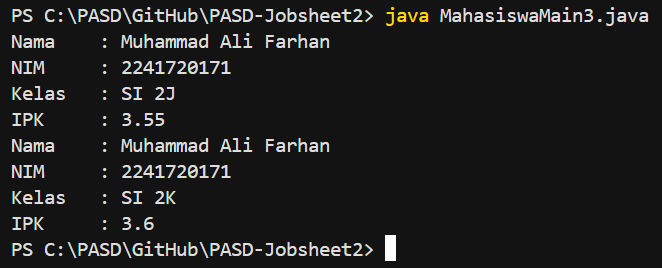

# JOBSHEET 2

# PERCOBAAN 

## - Percobaan 1 : Deklarasi Class, Atribut dan Method

## - Percobaan 1 : Verifikasi Hasil Percobaan 


_Pertanyaan:_

1.  Sebutkan dua karakteristik class atau object!
2.  Perhatikan class Mahasiswa pada Praktikum 1 tersebut, ada berapa atribut yang dimiliki oleh class Mahasiswa? Sebutkan apa saja atributnya!
3.  Ada berapa method yang dimiliki oleh class tersebut? Sebutkan apa saja methodnya!
4.  Perhatikan method updateIpk() yang terdapat di dalam class Mahasiswa. Modifikasi isi method tersebut sehingga IPK yang dimasukkan valid yaitu terlebih dahulu dilakukan pengecekan apakah IPK yang dimasukkan di dalam rentang 0.0 sampai dengan 4.0 (0.0 <= IPK <= 4.0). Jika IPK tidak pada rentang tersebut maka dikeluarkan pesan: "IPK tidak valid. Harus antara 0.0 dan 4.0".
5.  Jelaskan bagaimana cara kerja method nilaiKinerja() dalam mengevaluasi kinerja mahasiswa,  kriteria apa saja yang digunakan untuk menentukan nilai kinerja tersebut, dan apa yang dikembalikan (di-return-kan) oleh method nilaiKinerja() tersebut?
6.  Commit dan push kode program ke Github

_Jawaban:_

1.  - Mempunyai sesuatu (Data, Properti, Variabel, State, Attribut)
    - Melakukan sesuatu (Tingkah laku, Behaviour, Fungsi, Method)
2.  Terdapat 4 atribut yang dimiliki oleh class Mahasiswa3.java yaitu : 
    - nama
    - nim
    - kelas
    - ipk
3.  Terdapat 4 method yang dimiliki oleh class Mahasiswa3.java yaitu : 
    - tampilkanInformasi() : void
    - ubahKelas(kelasBaru: String) : void 
    - updateIPK(ipkBaruL: double) : void
    - nilaiKinerja(ipk: double) : String
4.  Code : 
    ```java 
        void updateIPK(double ipkBaru){
        if (ipkBaru >= 0.0 && ipkBaru <= 4.0) {
            ipk = ipkBaru;
        } else {
            System.out.println("IPK tidak valid. Harus antara 0.0 dan 4.0");
        }
    }
    ```
5.  a. Method nilaiKinerja() bekerja dengan memeriksa nilai IPK mahasiswa, lalu menentukan kategori kinerja berdasarkan rentang IPK menggunakan struktur if-else if-else 
    - Program akan membaca nilai ipk
    - Membandingkan dengan batas tertentu 
    - Mengembalikan (return) teks sesuai kategori yang cocok

    b. Kriteria yang digunakan (Method ini menggunakan rentang IPK sebagai dasar penilaian) :
    - Rentang IPK : IPK >= 3.5 | Kategori Kinerja : Kinerja sangat baik  
    - Rentang IPK : IPK >= 3.0 | Kategori Kinerja : Kinerja baik 
    - Rentang IPK : IPK >= 2.0 | Kategori Kinerja : Kinerja cukup 
    - Rentang IPK : IPK < 2.0  | Kategori Kinerja : Kinerja kurang
    Urutan pengecekan sangat penting dikarenakan dijalankan dari atas ke bawah
    
    c. Apa yang dikembalikan (return)?
    - Method ini bertipe String, jadi yang dikembalikan adalah teks kategori kinerja, yaitu salah satu dari : "Kinerja sangat baik", "Kinerja baik", "Kinerja cukup", "Kinerja kurang"

## - Percobaan 2 : Instansiasi Object, serta Mengakses Atribut dan Method

## - Percobaan 2 : Verifikasi Hasil Percobaan 



_Pertanyaan:_

1.  Pada class MahasiswaMain, tunjukkan baris kode program yang digunakan untuk proses instansiasi! Apa nama object yang dihasilkan?
2.  Bagaimana cara mengakses atribut dan method dari suatu objek?
3.  Mengapa hasil output pemanggilan method tampilkanInformasi() pertama dan kedua berbeda?

_Jawaban:_

1.  Kode program untuk proses instansiasi (membuat object) :
    ```java
    Mahasiswa3 mhs1 = new Mahasiswa3();
    ```
    - Penjelasan : 
    a. Mahasiswa3 : nama class 
    b. new Mahasiswa3() : proses membuat object baru dari class tersebut 
    c. mhs1 : nama object yang dihasilkan 
2.  a. Untuk mengakses atribut dan method dari suatu object, menggunakan operator titik (.)
    ```java
        namaObjek.namaAtribut
        namaObjek.namaMethod()
    ```
    b. Contoh kode pada class MahasiswaMain3.java
    ```java
        mhs1.nama = "Muhammad Ali Farhan";
        mhs1.ipk = 3.55;
    ```
    Penjelasan :
    - mhs1 : nama object
    - nama dan ipk : atribut 
    - Tanda titik (.) digunakan untuk mengakses anggota dari object
    d. Mengakses method : 
    ```java 
        mhs1.tampilkanInformasi();
        mhs1.ubahKelas("SI 2K");
        mhs1.updateIPK(3.60);
    ```
    Penjelasan : 
    - mhs1 : nama object
    - tampilkanInformasi(), ubahKelas(), updateIPK() : method
    - Method dipanggil menggunakan tanda titik dan tanda kurung ()
3.  Output pertama dan kedua berbeda karena sebelum pemanggilan kedua dilakukan perubahan nilai atribut kelas kelas dan ipk melalui method ubahKelas() dan updateIPK(), sehingga data yang ditampilkan sudah diperbarui.


