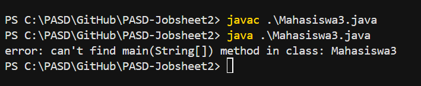

# JOBSHEET 2

# PERCOBAAN 

## - Percobaan 1 : Deklarasi Class, Atribut dan Method

## - Percobaan 1 : Verifikasi Hasil Percobaan 



_Pertanyaan:_

1.  Sebutkan dua karakteristik class atau object!
2.  Perhatikan class Mahasiswa pada Praktikum 1 tersebut, ada berapa atribut yang dimiliki oleh class Mahasiswa? Sebutkan apa saja atributnya!
3.  Ada berapa method yang dimiliki oleh class tersebut? Sebutkan apa saja methodnya!
4.  Perhatikan method updateIpk() yang terdapat di dalam class Mahasiswa. Modifikasi isi method tersebut sehingga IPK yang dimasukkan valid yaitu terlebih dahulu dilakukan pengecekan apakah IPK yang dimasukkan di dalam rentang 0.0 sampai dengan 4.0 (0.0 <= IPK <= 4.0). Jika IPK tidak pada rentang tersebut maka dikeluarkan pesan: "IPK tidak valid. Harus antara 0.0 dan 4.0".
5.  Jelaskan bagaimana cara kerja method nilaiKinerja() dalam mengevaluasi kinerja mahasiswa,  kriteria apa saja yang digunakan untuk menentukan nilai kinerja tersebut, dan apa yang dikembalikan (di-return-kan) oleh method nilaiKinerja() tersebut?
6.  Commit dan push kode program ke Github

_Jawaban:_

1.  - Mempunyai sesuatu (Data, Properti, Variabel, State, Attribut)
    - Melakukan sesuatu (Tingkah laku, Behaviour, Fungsi, Method)
2.  Terdapat 4 atribut yang dimiliki oleh class Mahasiswa3.java yaitu : 
    - nama
    - nim
    - kelas
    - ipk
3.  Terdapat 4 method yang dimiliki oleh class Mahasiswa3.java yaitu : 
    - tampilkanInformasi() : void
    - ubahKelas(kelasBaru: String) : void 
    - updateIPK(ipkBaruL: double) : void
    - nilaiKinerja(ipk: double) : String
4.  Code : 
    ```java 
        void updateIPK(double ipkBaru){
        if (ipkBaru >= 0.0 && ipkBaru <= 4.0) {
            ipk = ipkBaru;
        } else {
            System.out.println("IPK tidak valid. Harus antara 0.0 dan 4.0");
        }
    }
    ```